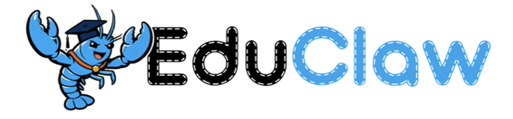
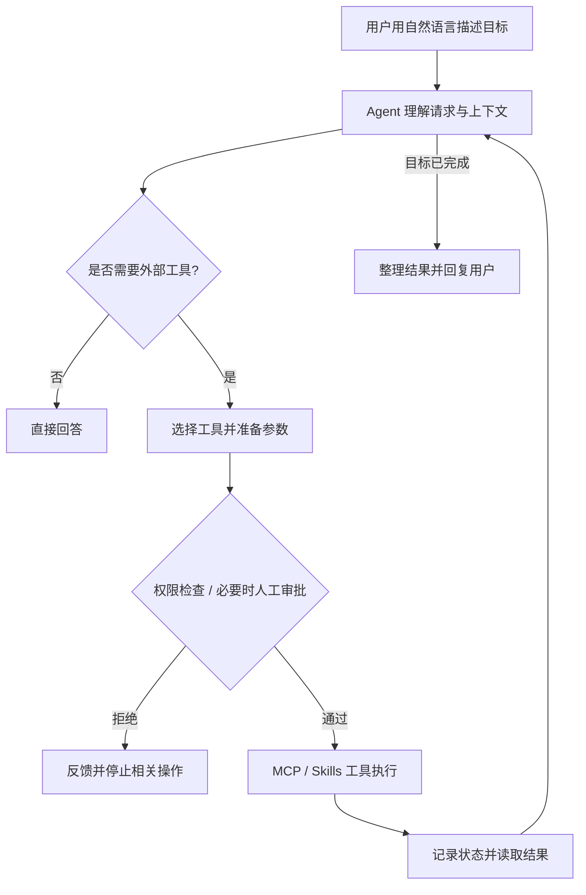

<div align="left">
  
  <h1>&nbsp;EduClaw</h1>
</div>

<p align="center"></p>

<p align="center">
  <strong>Your Personal AI Agent for Learning, Research & Everyday Work</strong><br>
  面向学习、科研与日常工作的个人 AI Agent
</p>

<p align="center">
  <a href="#项目介绍">简体中文</a> · <a href="#产品亮点">产品亮点</a> · <a href="#english">English</a> · <a href="#快速开始">快速开始</a> · <a href="#参与贡献">参与贡献</a>
</p>

> [!NOTE]
> EduClaw 是一个持续开发中的开源项目，目前主要通过命令行交互。不同工具和 Skills 的可用性取决于本地环境、配置及权限；尚未经过完整的生产环境安全审计。

开发路线与验收记录：[路线图](docs/ROADMAP.md) · [阶段进度和 Windows 测试](docs/DEVELOPMENT_STATUS.md)。
多步骤任务可用 `/任务`、`/状态`、`/允许`、`/继续`、`/结果` 操作；多个任务时用
`/任务 <编号>` 选择。用 `/重规划 <修改要求>` 修改未执行步骤，`/确认` 审阅并提交，
`/取消` 放弃草案。代码执行仍需预览后输入 `EXECUTE`，重规划提交需输入 `REPLAN`。
`/暂停` 阻止后续步骤，`/取消任务` 请求终止任务；`/恢复` 展示恢复预览并要求确认，
`/诊断`、`/失败` 查看证据和原因。恢复不会重放已经认领的工具，也不会自动授予权限。

## 项目介绍

**EduClaw 是一个以自然语言为交互入口、以实际任务为导向的个人 AI Agent。**

我们希望个人 AI 助手不仅能够回答问题，还能在用户授权的边界内理解目标、利用工具、组织信息、处理数据，并逐步完成真实任务。

EduClaw **以教育、学习与科研为重要应用场景，但不局限于教育**。无论是学生整理课程资料、研究人员分析实验数据、教师处理文档，还是个人用户完成日常知识工作，都可以通过自然语言与 EduClaw 协作。

**我们的设计理念：**

- **自然交互**：描述想完成的事，而不是学习一套工具命令。
- **行动能力**：在需要时调用外部工具，而不仅停留在文本回答。
- **个人化与上下文**：探索会话、记忆和知识检索能力，让助手更好地利用已有信息。
- **开放扩展**：通过 MCP 和 Skills 连接不同工具与场景。
- **可控可信**：敏感操作由可信权限层校验，并在必要时由用户审批。

## ✨ 产品亮点

**不只是回答问题，而是把事情往前推进。** EduClaw 希望把自然语言理解、个人知识、外部工具与可控执行整合到同一个助手中，让用户专注于目标，而不是操作流程。

| 产品亮点 | 对用户意味着什么 | 当前实现情况 |
| --- | --- | --- |
| 🗣️ **一句话发起任务** | 直接说“读取报告、核对预算并分析风险”，不必先判断要不要使用多步骤模式 | 已验证自然语言选择工具与执行基础任务 |
| 🔄 **边做边决定下一步** | 先读取真实文件，再根据结果判断是否需要计算或进一步处理，而不是机械执行预设脚本 | 已实现受限动态决策；复杂跨工具任务仍需加强验证 |
| 🔌 **工具与 Skills 可扩展** | 同一个助手可逐步接入文档、Python、检索和教育科研工具，不必为每个场景开发独立聊天机器人 | 已有 MCP/Skills 架构，具体能力依赖配置 |
| 🔐 **有边界的自主行动** | Agent 能提出操作，但读取受限文件、运行代码等操作需经过可信权限校验和必要审批 | 已有路径授权、代码审批及全局工具网关 |
| 🧠 **围绕个人资料持续工作** | 结合会话、记忆和知识检索模块，逐步支持围绕课程资料、论文和个人文件开展工作 | 已有基础模块，长期记忆与检索体验仍在完善 |
| 🎓 **通用 Agent，教育科研优先** | 既能处理日常知识工作，也重点探索课程学习、文献阅读、实验分析等实际需求 | 已覆盖部分基础场景，专业化流程持续建设 |

### 从“聊天”到“完成任务”

例如，用户只需提出：

> 读取这份项目报告，检查预算是否超支，找出最需要关注的风险，并告诉我原因。

EduClaw 可以在获得必要授权后读取 PDF、提取表格、核对预算数字、结合风险信息给出结论。**用户不需要事先指定 `extract_pdf`、`run_python_code` 或 `/multi`。** 是否调用额外工具，由任务需要和实际结果决定。

在当前已验证的示例中，EduClaw 读取了一份两页项目报告，识别出计划预算 **$20,700**、实际支出 **$20,100**，并指出技术问题是报告列出的高风险项。这个示例体现了产品方向：**理解目标 → 使用工具 → 基于证据回答**，而不是单纯复述文件内容。

> **设计原则：自主不等于失控。** EduClaw 可以自主规划下一步，但不能自主授予文件访问权或绕过代码执行审批；复杂任务的可靠性和恢复能力仍在持续完善。

## EduClaw 可以做什么？

| 方向 | 典型场景 | 当前说明 |
| --- | --- | --- |
| 💬 智能对话 | 概念讲解、学习答疑、思路讨论、内容总结 | 已具备基本对话能力 |
| 📚 文档理解 | 读取 PDF、Word、PPTX、Excel，提取正文和表格 | 已有文档处理工具；受格式、权限及环境限制 |
| 🔎 知识检索 | 对个人资料建立索引，检索相关知识片段 | 仓库包含向量检索与知识库模块；需单独配置和验证 |
| 🧮 数据与代码 | 生成 Python、完成计算、辅助数据分析 | 已有受审批保护的 Python 工具执行链路 |
| 🧠 记忆与状态 | 管理会话、任务进度和部分持久化信息 | 仓库包含记忆、状态与 SQLite 相关实现；能力成熟度不一 |
| 🔗 工具与技能 | 按任务调用 MCP 工具、加载场景化 Skills | 具备扩展基础，具体可用工具取决于配置 |
| 🎓 教育与科研 | 课程资料处理、文献整理、实验数据辅助分析、作业批改流程探索 | 重点应用方向；部分 Skills 尚未完成端到端产品验收 |
| 🤖 自主任务 | 判断是否需要工具，并依据结果决定后续步骤 | 已具备受限的自然语言自主执行能力 |

### 使用场景

**学习与课程**

> “解释一下 Transformer 的自注意力机制，并给我一个适合入门的学习思路。”

**科研与数据**

> “读取这份实验报告，整理关键数据，分析可能存在的异常。”

**文档与知识管理**

> “帮我提取这个 PDF 中的表格，概括重要结论。”

**日常效率**

> “用 Python 计算这些数值的统计指标，并解释结果。”

这些示例体现项目希望覆盖的场景，不表示所有文档生成、知识库写入或跨应用自动化功能都已完整开放。

## 工作方式

EduClaw 将语言模型的理解与决策能力，同工具调用、状态管理和安全控制结合起来：



对于复杂请求，Agent 可以分步骤处理；对于简单问题，则无需为了“自动化”而强行调用工具。**是否执行敏感操作由可信网关控制，不由语言模型自行决定授权。**

## 项目架构

EduClaw 采用模块化设计，便于替换模型、扩展工具和逐步完善 Agent 能力。

| 模块 | 职责 | 相关技术与实现 |
| --- | --- | --- |
| Agent 核心 | 理解请求、规划和协调工具 | LangChain / LangGraph、`core/agent` |
| 模型接入 | 封装大语言模型调用 | `core/llm` |
| 工具与服务 | 提供文档解析、代码执行等外部能力 | MCP、`core/mcp`、`core/tools` |
| Skills | 为特定任务组织工具使用说明与工作流 | `skills` |
| 记忆与检索 | 存储、查询和利用个人知识 | `core/memory`、Chroma 相关模块 |
| 任务与状态 | 管理任务、会话、检查点和执行记录 | `core/tasks`、`core/state`、SQLite |
| 安全控制 | 文件访问授权、代码审批、工具调用校验 | `core/security`（迭代新增） |
| 异常与日志 | 记录执行过程、处理异常 | `core/error_handling`、`core/logging` |
| 用户入口 | 接收自然语言和必要的审批操作 | `core/usr/main.py`（CLI） |

### 仓库结构（简化）

```text
EduClaw/
├── assets/                # 品牌素材
├── core/
│   ├── agent/             # Agent 核心
│   ├── llm/               # LLM 适配
│   ├── mcp/               # MCP 客户端与服务端
│   ├── tools/             # 文档、检索、沙箱等工具
│   ├── memory/            # 记忆与向量存储
│   ├── tasks/             # 任务管理
│   ├── state/             # 状态管理
│   ├── security/          # 审批与安全网关（新版代码）
│   ├── error_handling/    # 异常处理
│   ├── logging/           # 日志
│   └── usr/               # CLI 入口
├── skills/                # 场景化 Skills
├── docs/                  # 项目文档
├── prompts/               # 提示词
└── test/                  # 测试（具体以当前分支为准）
```

> 目录根据基础仓库与后续增量开发整理；不同分支可能存在差异。

## 快速开始

### 环境准备

- Python 环境（推荐使用 Conda 隔离依赖）。
- 可用的大语言模型服务及对应凭据。
- 所需 MCP 服务和工具依赖。
- 若使用 Python 沙箱执行功能，需配置项目对应的 Docker 执行环境。

本项目仍在整理统一安装流程。请以仓库当前依赖清单、环境配置和工具文档为准，不要直接将某个开发阶段的临时配置视为通用安装方案。

### 启动

在已配置完成的开发环境中：

```powershell
conda activate educlaw
cd D:\wgm\EduClaw
python -m core.usr.main
```

`D:\wgm\EduClaw` 是开发环境示例路径，请替换为自己的项目目录。

启动后直接输入自然语言即可，例如：

```text
解释一下 LangGraph 与 LangChain 的区别。
```

或：

```text
读取 D:\data\report.pdf，提取其中的预算数据并分析差额。
```

当操作涉及受保护文件或 Python 代码执行时，当前 CLI 会要求用户进行明确审批。详细的开发命令、测试脚本与阶段验收方式可放在 `docs/` 中维护，而不是作为 README 的主要内容。

## 安全与隐私

EduClaw 的目标不是让 Agent 获得无限制的本地执行权限，而是在**用户可理解、可审查、可控制**的边界内完成任务。

- **最小权限**：文件读取遵循路径授权规则，未授权操作会被拦截。
- **人工介入**：代码执行等敏感工具需要审核精确的工具参数和代码内容。
- **可信校验**：权限判断在工具调用网关执行，不依赖模型的自我约束。
- **可追踪**：保留相关任务、审批与执行记录，以便定位问题。
- **审慎恢复**：对结果不确定的外部操作避免盲目重复执行。

> [!WARNING]
> 项目仍处于开发阶段。Docker 沙箱、审批机制和工具网关均不能替代完整安全审计；请勿在未经评估的情况下授予敏感数据或高权限系统访问。

## 项目现状与发展方向

EduClaw 已建立基础的 Agent、模型接入、MCP 工具、Skills、记忆/检索、任务管理和状态管理等模块，并逐步加入自然语言自主执行、人工审批和持久化能力。

目前更适合开发者本地体验和共同完善，尚不是开箱即用的成熟桌面助手。未来重点包括：

- **更可靠的任务执行**：异常恢复、结果验证、长任务恢复与状态一致性。
- **更自然的产品体验**：简洁的进度反馈、更易用的审批交互，以及图形界面探索。
- **更丰富的能力生态**：完善 MCP 与 Skills 接入，支持更多知识工作和教育科研场景。
- **更好的个人化能力**：逐步完善长期记忆、个人知识库和上下文利用。
- **更完整的开发体验**：统一安装、配置、测试和贡献文档。

项目路线将随社区反馈持续调整，不以某个开发阶段的编号定义产品本身。

## 参与贡献

欢迎对 EduClaw 感兴趣的开发者、学生、教师和科研工作者参与建设。可以通过 Issue 反馈问题、提出使用场景，或提交 Pull Request 改进 Agent、工具、Skills、测试和文档。

反馈 Bug 时，请尽量提供复现步骤和必要日志，并移除 API Key、个人数据等敏感信息。

## 开源协议

项目原 README 标注采用 **MIT License**。正式发布时，请以仓库根目录的 `LICENSE` 文件为准，并确认第三方依赖与素材的授权情况。

---

<a id="english"></a>

## English

### About EduClaw

**EduClaw is a personal AI agent for learning, research, and everyday work.** It brings natural-language interaction together with tools, task orchestration, memory-related components, and user-controlled permissions.

Education and research are central use cases, **not hard boundaries**. EduClaw is intended to grow into a general-purpose personal assistant that can help people understand information and carry out practical tasks.

### Why EduClaw?

**From conversation to action, with the user in control.** EduClaw is designed around six product ideas:

- **Ask naturally, not in commands.** Describe the outcome; the assistant decides whether tools or multiple steps are needed.
- **Act on real results.** Read a document first, then decide what analysis to perform based on its actual contents.
- **Extend through MCP and Skills.** Connect specialized capabilities without turning each use case into a separate chatbot.
- **Keep sensitive actions reviewable.** File permissions and code execution are enforced by a trusted gateway, with human approval where required.
- **Work with personal knowledge.** Memory and retrieval components provide a foundation for working across personal learning and research materials.
- **Education-first, not education-only.** Support study and research while remaining useful for everyday knowledge work.

For example, a user can simply ask EduClaw to read a project PDF, compare planned and actual costs, and summarize risks. The assistant can choose a document tool, inspect the returned tables, and produce an evidence-based answer—without requiring the user to select a workflow command.

*Current scope:* Natural-language tool selection, selected dynamic workflows, and approval-protected operations have been tested. Long-running recovery, broad tool coverage, and production-grade reliability remain in development.

### What it aims to offer

- **Natural-language interaction** — describe goals instead of manually assembling workflows.
- **Tool-assisted work** — use MCP-connected tools for document processing, Python execution, and other tasks.
- **Knowledge and context** — build on memory and retrieval modules to support personal information workflows.
- **Extensibility** — organize specialized capabilities through Skills and modular integrations.
- **Human control** — require approval for sensitive actions and enforce permissions at the tool gateway.

### Architecture

The project is built around Python, LangChain/LangGraph, MCP, modular Skills, SQLite-backed task state, and memory/retrieval components including Chroma-related code. The primary interface is currently a CLI.

### Getting started

After configuring Python dependencies, an LLM provider, and the required MCP services:

```powershell
conda activate educlaw
python -m core.usr.main
```

For code execution, configure the project's Docker-based tool environment. Some features require additional setup and are not yet fully integrated into the default autonomous workflow.

### Status and contributions

EduClaw is an **active open-source development project**, not a production-ready assistant. We welcome bug reports, documentation improvements, new Skills, and contributions to reliability, security, and user experience.

**License:** The original README states MIT; confirm the repository's `LICENSE` file before release.
